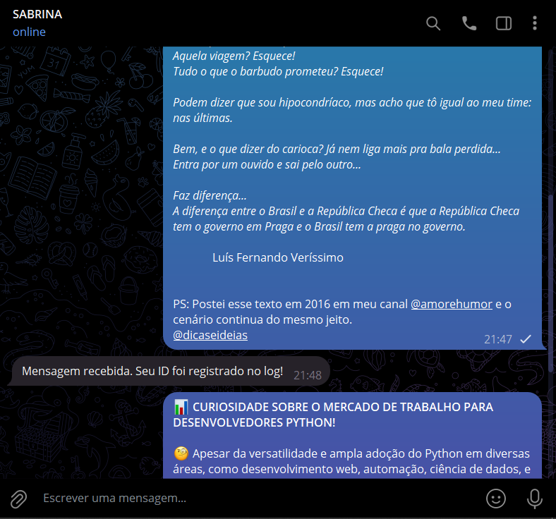
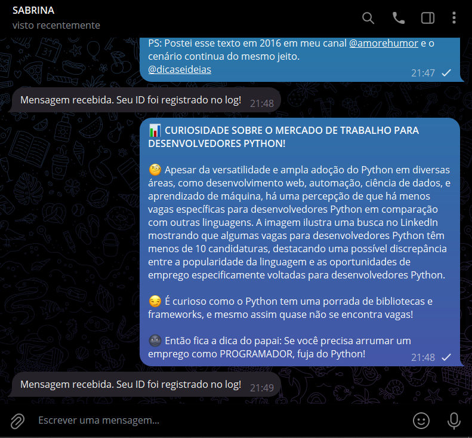
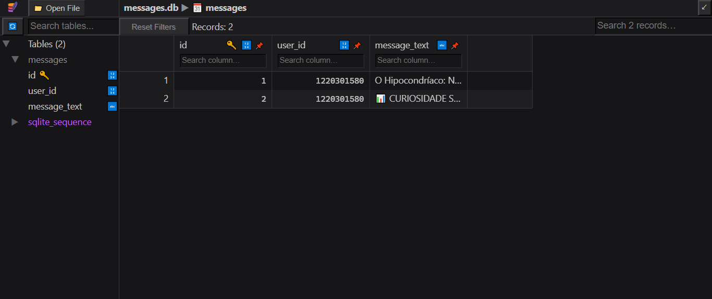
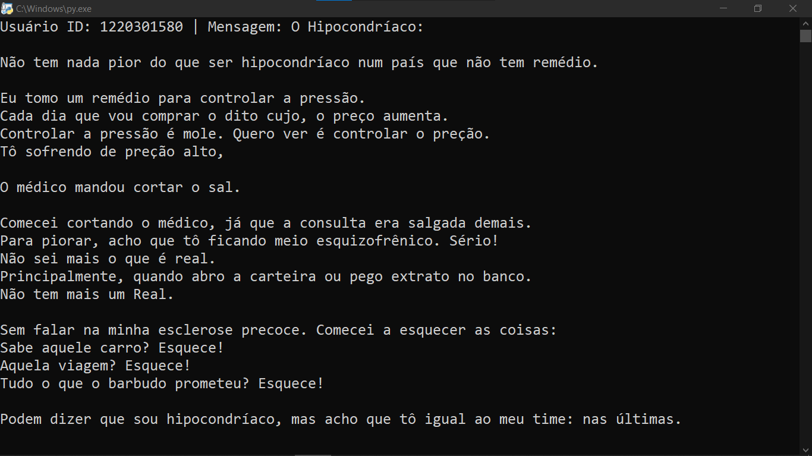
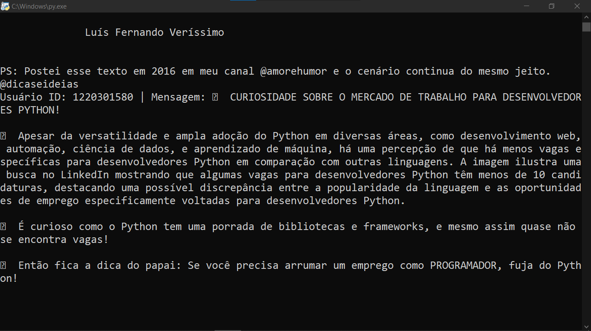

# LOGID COM SQLITE
🤤ESSE É UM BOT DO TELEGRAM FEITO COM PYROGRAM. É ÚTIL PARA ADMINISTRADORES QUE DESEJAM MANTER UM REGISTRO ORGANIZADO DAS INTERAÇÕES DOS USUÁRIOS, UTILIZANDO UM BANCO DE DADOS LOCAL PARA ARMAZENAMENTO E POSTERIOR ANÁLISE DAS MENSAGENS RECEBIDAS.

 <br>
 <br>
 <br>
 <br>
 <br>

## DESCRIÇÃO:
Este bot foi desenvolvido usando Pyrogram para Telegram e SQLite para armazenamento local de dados. Ele registra mensagens recebidas no console do servidor e as armazena em um banco de dados SQLite. Ideal para monitorar interações de usuários e manter um registro detalhado das mensagens recebidas pelo bot.

## FUNCIONALIDADES:
- **Registro de Mensagens**: Registra no console do servidor o ID do usuário e o conteúdo da mensagem recebida pelo bot.
- **Armazenamento em Banco de Dados**: Utiliza SQLite para armazenar permanentemente as mensagens recebidas, permitindo consultas e análises posteriores.
- **Resposta Automática**: Responde automaticamente ao usuário com uma mensagem de confirmação sempre que uma mensagem é recebida e registrada.
- **Fácil Integração**: Configuração simples e execução direta, adequada para iniciantes e desenvolvedores experientes.

## EXECUTANDO O PROJETO:
1. **Autorização do usuário:**
   - Para usar a API, o Telegram requer que os usuários sejam autorizados por meio de seus números de telefone. Para fazer isso, siga as instruções do Telegram em [https://core.telegram.org/api/obtaining_api_id](https://core.telegram.org/api/obtaining_api_id). A chave da API consiste em duas partes: `api_id` e `api_hash`. Mantenha-a secreta. [SAIBA MAIS.](https://docs.pyrogram.org/start/setup)

   - Após a autorização bem-sucedida, um novo arquivo chamado `my_account.session` será criado, permitindo que o Pyrogram execute chamadas de API com sua identidade. Este arquivo é pessoal e será recarregado automaticamente quando você reiniciar seu aplicativo. O `my_account.session` funciona como o token do seu bot. Depois de gerado, coloque-o dentro do diretório `CODIGO`. [SAIBA MAIS.](https://docs.pyrogram.org/start/auth)
   
2. **Instalando as dependências:**
   - Antes de executar o bot, certifique-se de instalar todas as dependências necessárias. No terminal, execute o seguinte comando para instalar as dependências listadas no arquivo `requirements.txt` em `CODIGO`:
   ```bash
   pip install -r requirements.txt
   ```

3. **Inicie o Bot:**
   - Execute o bot do Telegram iniciando-o com o seguinte comando:
    ```bash
    python CODIGO.py
    ```

4. **Interagindo com o Bot**:
   - Envie mensagens privadas para o bot no Telegram.
   - Cada mensagem enviada será registrada no console do servidor junto com o ID do usuário que a enviou.
   - Além do registro no console, as mensagens serão armazenadas no banco de dados SQLite `messages.db` no mesmo diretório do código.

## NÃO SABE?
- Entendemos que para manipular arquivos em muitas linguagens e tecnologias relacionadas, é necessário possuir conhecimento nessas áreas. Para auxiliar nesse aprendizado, oferecemos cursos gratuitos disponíveis:
* [CURSO DE PYROGRAM](https://github.com/VILHALVA/CURSO-DE-PYROGRAM)
* [CURSO DE PYTHON](https://github.com/VILHALVA/CURSO-DE-PYTHON)
* [CURSO DE SQLITE](https://github.com/VILHALVA/CURSO-DE-SQLITE)
* [CURSO DE PYTHON COM SQLITE](https://github.com/VILHALVA/CURSO-DE-PYTHON-COM-SQLITE)
* [CONFIRA MAIS CURSOS](https://github.com/VILHALVA?tab=repositories&q=+topic:CURSO)

## CREDITOS:
- [VERSÃO MELHORADA DO "LOGID COM PYROGRAM"](https://github.com/VILHALVA/LOGID-COM-PYROGRAM)
- [PROJETO FEITO PELO VILHALVA](https://github.com/VILHALVA)

